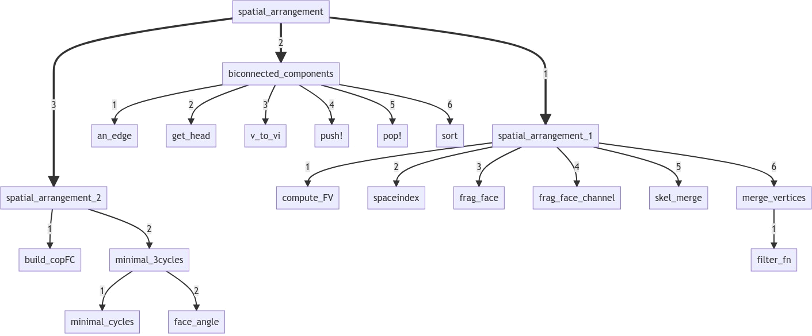

% Relazione LAR TGW 3D - Gruppo 8b
% Luca Maria Lauricella; Valerio Marini;
% \today

Progetto relativo al Corso di Calcolo Parallelo e Distribuito del 
Prof. Paoluzzi presso l'Università Roma Tre.

Repository del progetto:
https://github.com/lauriluca99/TGW-3D.jl

Documentazione del progetto:
https://lauriluca99.github.io/TGW-3D.jl

\tableofcontents

# Introduzione Linear Algebraic Rappresentation:

LAR è uno schema rappresentativo per modelli geometrici e topologici. Il
dominio di questo schema consiste in complessi di cellule formati a loro
volta da matrici sparse (matrici con grande affluenza di zeri).
L’analisi di questi complessi cellulari è fatta attraverso semplici
operazioni algebriche lineari, la più comune è la moltiplicazione sparsa
matrice/vettore.

Dato che LAR permette una computazione efficiente di qualsiasi modello
topologico, viene utilizzato con un linguaggio di programmazione,
anch’esso efficiente e veloce, come Julia, il quale permette di sfruttare tutte le
sue potenzialità.

## Perché LAR?

Scegliamo LAR in quanto l’aumento della complessità dei dati geometrici
e dei modelli topologici richiedono una migliore rappresentazione e un
modello matematico appropriato per tutte le strutture topologiche. Quindi si ha
un complesso co-chain formato da collezioni di matrici sparse.

Un complesso chain consiste in una sequenza di moduli dove la singola
immagine di ognuno è contenuta nel nucleo della successiva (successivo
conosce precedente).

Un complesso co-chain è la stessa cosa ma con direzioni opposte.

# Obiettivo del progetto
In questo progetto si vuole ottimizzare e parallelizzare il codice dell'algoritmo TGW 3D presente
nella libreria LinearAlgebraicRappresentation.jl 

## TGW 3D

L’algoritmo Topological Gift Wrapping calcola le
d-celle di una partizione di spazio generate da loro partendo da un
oggetto geometrico d-1 dimensionale.

TGW prende una matrice sparsa di dimensione d-1 in input e produce in
output la matrice sparsa di dimensione d sconosciuta aumentata dalle
celle esterne.

# Studio Preliminare

## spatial_arrangement.jl
L'algoritmo TGW 3D è implementato all'interno del file spatial_arrangement.jl

### Funzioni presenti

#### **spatial\_arrangement:**

Calcola la partizione dei complessi cellulari dati, con scheletro di
dimensione 2, in 3D.

Un complesso cellulare è partizionato quando l’intersezione di ogni
possibile paio di celle del complesso è vuota e l’unione di tutte le
celle è l’insieme dello spazio Euclideo. La funzione ritorna la
partizione complessa come una lista di vertici V e una catena di bordi
EV, FE, CF.

#### *spatial\_arrangement\_1:*

Si occupa del processo di frammentazione delle facce per l’utilizzo del
planar arrangement.

1.  <u>compute\_FV:</u>

> Ritorna l’array FV di tipo Lar.Cells dal prodotto di due array sparsi
> in input di tipo Lar.ChainOp.

2.  <u>spaceindex:</u>

> Dato un modello geometrico, calcola le intersezioni tra i bounding
> box. Nello specifico, la funzione calcola le 1-celle e il loro
> bounding box attraverso la funzione boundingBox. Si suddividono le
> coordinate *x* e *y* in due dizionari chiamando la funzione
> coordintervals. Per entrambe le coordinate *x* e *y*, si calcola un
> intervalTree cioè una struttura dati che contiene intervalli. La
> funzione boxCovering viene chiamata per calcolare le sovrapposizioni
> sulle singole dimensioni dei bounding Box. Intersecando quest’ultime,
> si ottengono le intersezioni effettive tra bounding box. La funzione
> esegue lo stesso procedimento sulla coordinata *z* se presente.
> Infine, si eliminano le intersezioni di ogni bounding box con loro
> stessi.

3.  <u>frag\_face:</u>

> Effettua la trasformazione in 2D delle facce fornite come parametro
> sigma, dopo di che ogni faccia sigma si interseca con le facce
> Presenti in sp\_index sempre fornito come parametro della funzione.

4.  <u>skel\_merge:</u>

> Effettua l’unione di due scheletri che possono avere 1 o 2 dimensioni.

5.  <u>merge\_vertices:</u>

> Effettua l’unione dei vertici, dei lati e delle facce vicine.

#### *biconnected\_components:*

Calcola le componenti biconnesse del grafo EV rappresenato da bordi,
ovvero coppie di vertici.

1.  <u>an\_edge:</u>

> Funzione che, dato in input un punto, prende un lato connesso ad esso.

2.  <u>get\_head:</u>

> Funzione che, dato in input un lato e la coda, fornisce la testa

3.  <u>v\_to\_vi:</u>

> Funzione che, dato un vertice in input, ritorna falso se la prima
> occerrenza della matrice è pari a 0 oppure ritorna il valore trovato.

4.  <u>push!:</u>

> Inserisce uno o più oggetti nella matrice.

5.  <u>pop!:</u>

> Rimuove l’ultimo oggetto nella matrice e lo ritorna.

6.  <u>sort:</u>

> Ordina la matrice e ne ritorna una copia.

#### *spatial\_arrangement\_2:*

Effettua la ricostruzione delle facce permettendo il wrapping spaziale
3D.

1.  <u>minimal\_3cycles:</u>

> Funzione che riporta i parametri dati in input in 3 dimensioni e
> calcola le nuove celle adiacenti per estendere i bordi della figura
> geometrica. Infine ritorna la matrice sparsa tridimensionale.

2.  <u>build\_copFC:</u>

> Funzione alternativa alla precedente.